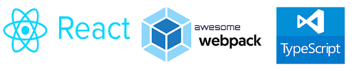

 
 
 
 

   

 

<h2>Start your react typescript project with manual webpack config in seconds</h2>

Flexible to control webpack, easy to deploy

<i>Keywords: React Starter, Webpack, Typescript, React.js, Redux, Babel, jest, react-router, sass, redux-thunk, pm2</i>

Created with by 👻 <a href="#">Aldenn</a>

 

# Overview

React-Typescript-Webpack was config with React, Typescript and Webpack without CRA. Faster to start your next react project.

---

# Documentation

Full documentation [here](https://thaind97git.github.io/react-typescript-webpack/)

## License

This project is licensed under the MIT license, Copyright (c) 2021 Aldenn.
For more information see `LICENSE.md`.
